# 🚀 End-to-End Tekton CI Pipeline (DevSecOps Enabled)

> ⚡ A complete **DevSecOps CI pipeline using Tekton**, from code commit to secure Docker image promotion, including SAST, SCA, container scanning, and webhook automation.

---

# 📌 Overview

This project demonstrates a **real-world CI pipeline** running on a **Kubernetes (Kind) cluster**, fully automated using:

* 🔁 GitHub Webhooks (via ngrok)
* ⚙️ Tekton Pipelines & Triggers
* 🔐 DevSecOps practices (SAST, SCA, Image Scanning)

---

# 🏗️ Architecture & Pipeline Flow

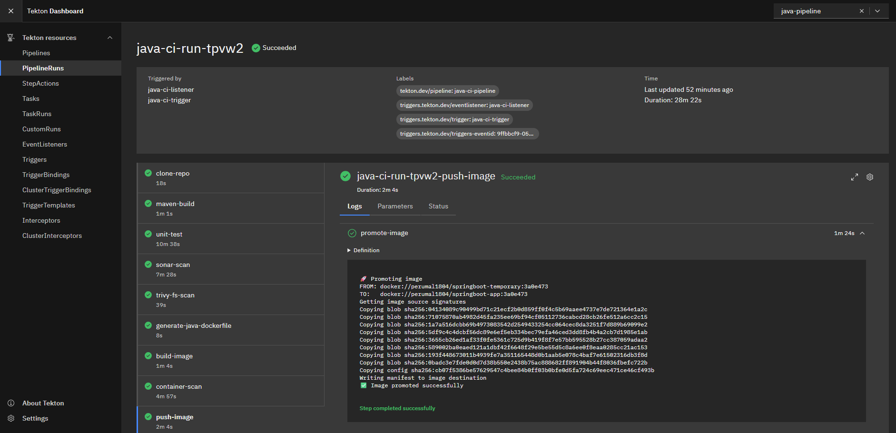

```text
Clone → Build → Test → SAST → SCA → Dockerfile → Build Image → Scan Image → Promote
```

---

# 🔥 Features

* Tekton-based Kubernetes-native CI
* GitHub webhook-triggered pipeline
* Maven build + unit testing
* SonarCloud (SAST)
* Trivy (SCA + Image Scan)
* Kaniko (Docker build without daemon)
* Secure image promotion using Skopeo
* Private DockerHub registry

---

# ⚙️ Prerequisites

* Kubernetes cluster (Kind recommended)
* kubectl
* Docker
* ngrok
* GitHub account
* DockerHub account
* SonarCloud account

---

# 🧰 Step 1: Setup Kubernetes (Kind)

```bash
kind create cluster
kubectl cluster-info
```

---

# 🧰 Step 2: Install Tekton

## Tekton Pipelines

```bash
kubectl apply --filename https://storage.googleapis.com/tekton-releases/pipeline/latest/release.yaml
```

## Tekton Triggers

```bash
kubectl apply --filename https://storage.googleapis.com/tekton-releases/triggers/latest/release.yaml
kubectl apply --filename https://storage.googleapis.com/tekton-releases/triggers/latest/interceptors.yaml
```

## Tekton Dashboard

```bash
kubectl apply --filename https://infra.tekton.dev/tekton-releases/dashboard/latest/release-full.yaml
```

Verify:

```bash
kubectl get pods -n tekton-pipelines
```

---

# 🌐 Step 3: Access Tekton Dashboard

```bash
kubectl port-forward -n tekton-pipelines service/tekton-dashboard 9097:9097
```

Open:
👉 http://localhost:9097

---

# 🏗️ Step 4: Setup Namespace

```bash
kubectl create namespace java-pipeline
```

---

# 🔐 Step 5: Setup Secrets

## 🔹 DockerHub Secret

```bash
kubectl create secret docker-registry dockerhub-secret \
  -n java-pipeline \
  --docker-username="" \
  --docker-password="" \
  --docker-email=""
```

```bash
kubectl patch secret dockerhub-secret -n java-pipeline \
  --type='merge' \
  -p='{"stringData":{"username":"","password":""}}'
```

---

## 🔹 SonarCloud Setup

### Create Account

* Go to: https://sonarcloud.io
* Login using GitHub
* Create:

  * Organization
  * Project

### Get Required Values

* **SONAR_TOKEN** → My Account → Security
* **SONAR_ORG**
* **SONAR_PROJECT_KEY**

### Create Secret

```yaml
apiVersion: v1
kind: Secret
metadata:
  name: sonar-config
type: Opaque
stringData:
  SONAR_TOKEN: ""
  SONAR_HOST_URL: "https://sonarcloud.io"
  SONAR_ORG: ""
  SONAR_PROJECT_KEY: ""
```

Apply:

```bash
kubectl apply -f sonar-secret.yaml -n java-pipeline
```

---

# ⚙️ Step 6: Apply Pipeline

```bash
kubectl apply -f ./tasks -n java-pipeline
kubectl apply -f ./pipeline.yaml -n java-pipeline
```

---

# ▶️ Step 7: Run Pipeline (Manual)

```bash
kubectl apply -f ./pipelinerun.yaml -n java-pipeline
kubectl get pipelineruns -n java-pipeline
```

---

# 🔁 Step 8: Setup Trigger (Webhook Automation)

## Apply Trigger Resources

```bash
kubectl apply -f triggerbinding.yaml -n java-pipeline
kubectl apply -f triggertemplate.yaml -n java-pipeline
kubectl apply -f eventlistener.yaml -n java-pipeline
```

---

## Expose EventListener

```bash
kubectl port-forward svc/el-java-ci-listener 8080:8080 -n java-pipeline
```

---

## Expose via ngrok

```bash
ngrok http 8080
```

Example:

```
https://abc123.ngrok.io
```

---

# 🔗 Step 9: Configure GitHub Webhook

Go to your repo:

**Settings → Webhooks → Add Webhook**

* Payload URL:

  ```
  https://abc123.ngrok.io
  ```
* Content type: `application/json`
* Event: **Push**

---

# 🧪 Step 10: Trigger Pipeline

```bash
git add .
git commit -m "trigger pipeline"
git push origin main
```

---

# 🔍 Step 11: Verify Execution

```bash
kubectl get pipelineruns -n java-pipeline
kubectl logs -l eventlistener=java-ci-listener -n java-pipeline
```

---

# 🔧 Tasks Explained (with Outputs)

---

## 🔹 1. Clone Repository

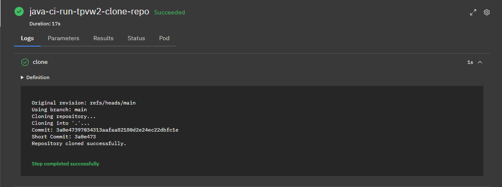

* Clones GitHub repo
* Handles branch normalization
* Outputs commit SHA

---

## 🔹 2. Maven Build

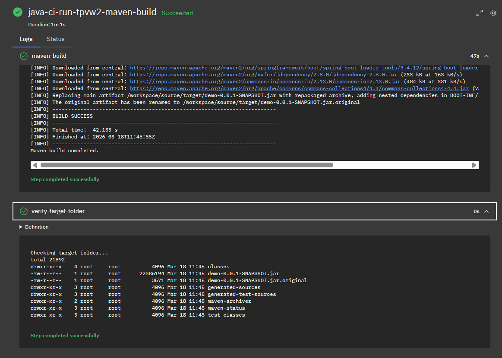

* Builds `.jar/.war`
* Skips tests initially

---

## 🔹 3. Unit Tests

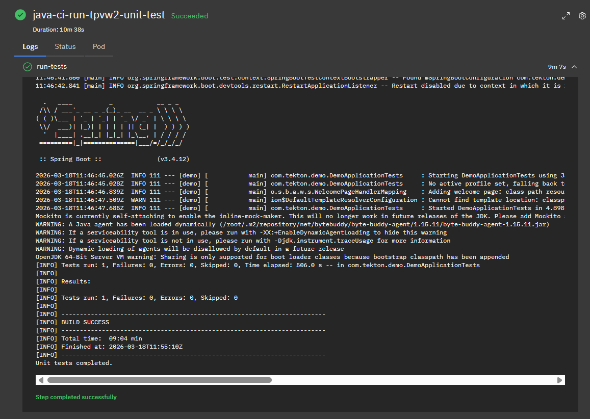

* Runs Maven tests
* Ensures code correctness

---

## 🔹 4. SonarCloud Scan (SAST)

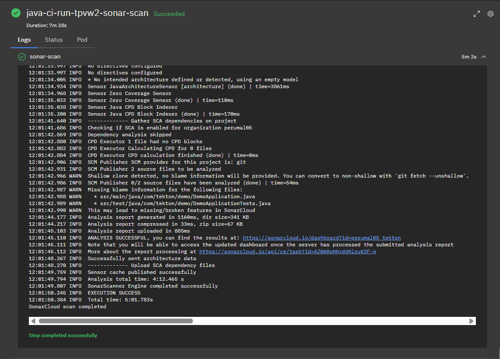

* Detects bugs & vulnerabilities
* Uses SonarCloud

---

## 🔹 5. Trivy FS Scan (SCA)

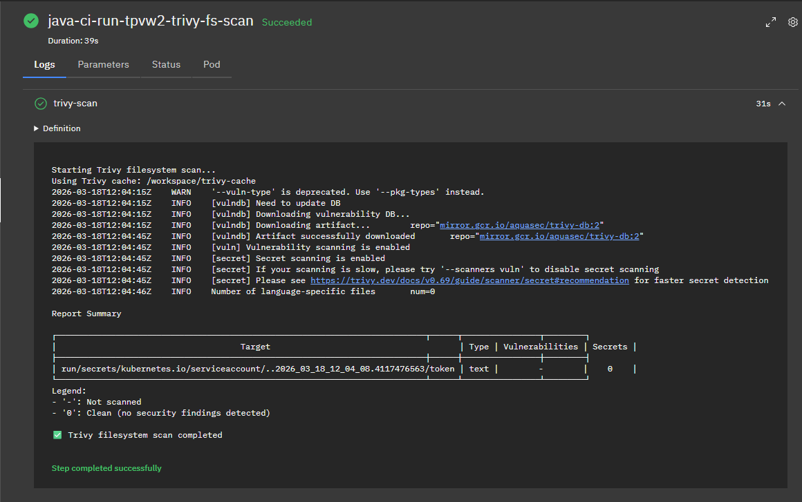

* Scans dependencies
* Detects vulnerable libraries

---

## 🔹 6. Generate Dockerfile

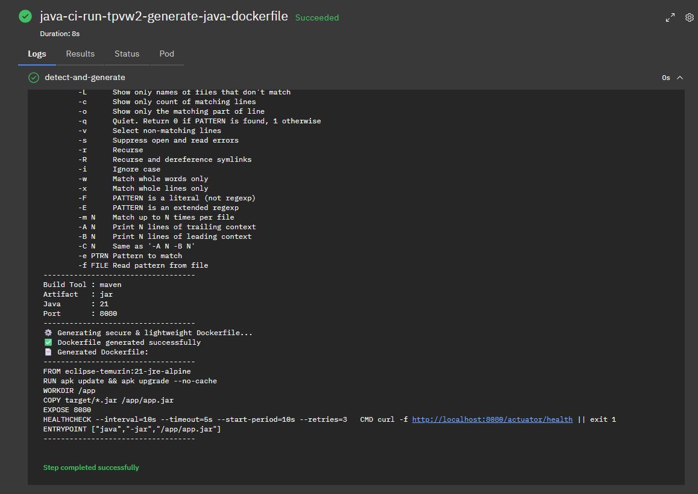

* Auto-detects:

  * Maven/Gradle
  * JAR/WAR
  * Port
* Generates optimized Dockerfile

---

## 🔹 7. Build Image (Kaniko)

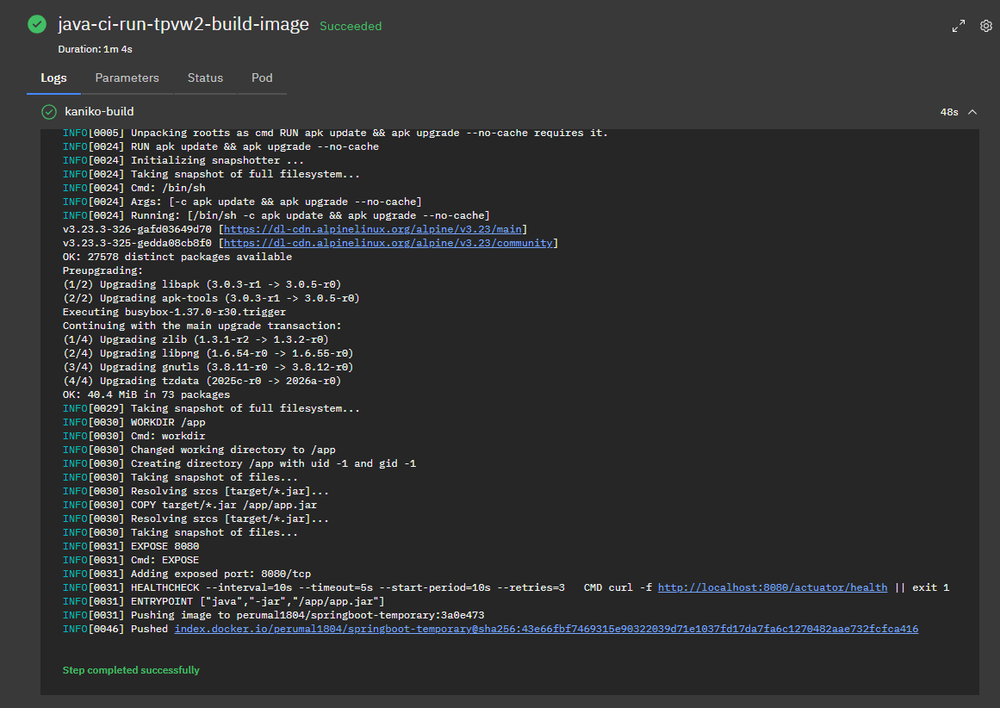

* Builds container image
* Pushes to **temporary repo**

---

## 🔹 8. Container Scan

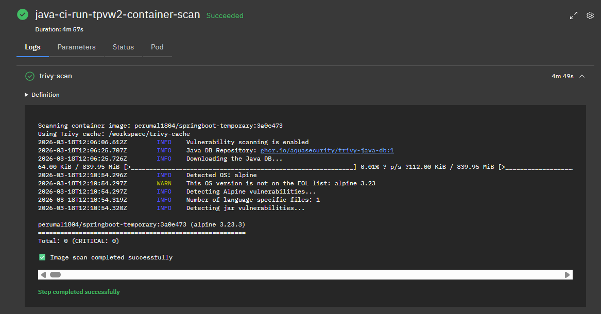

* Scans image layers
* Blocks vulnerable images

---

## 🔹 9. Push Final Image

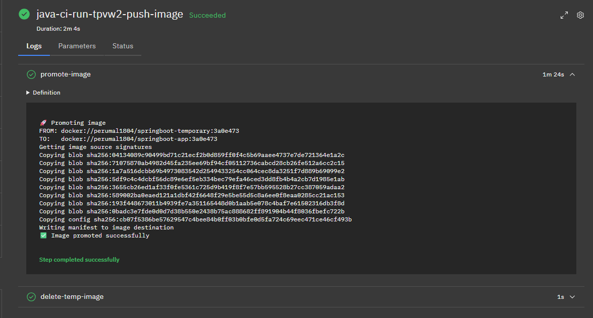

* Promotes image → final repo
* Deletes temp image

---

# 📊 Dashboards

## 🔹 SonarCloud

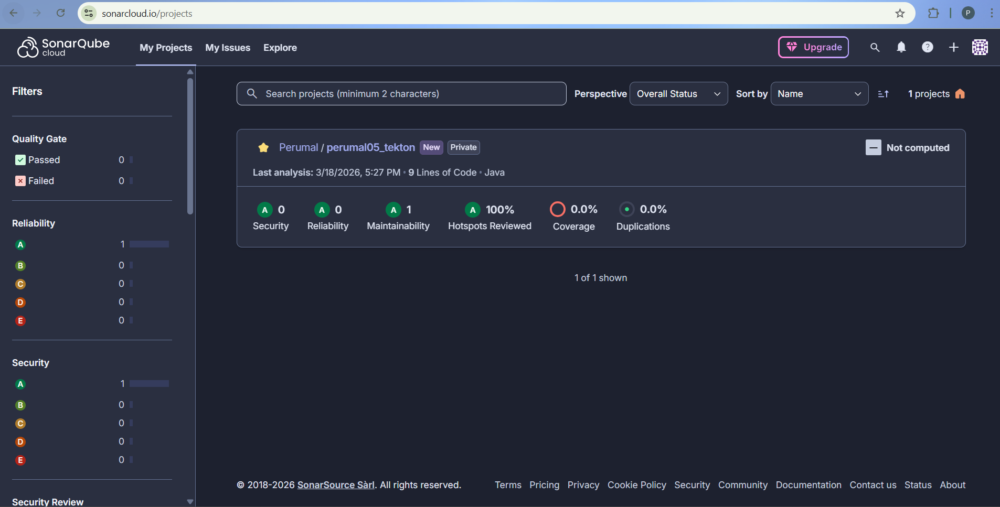

---

## 🔹 DockerHub

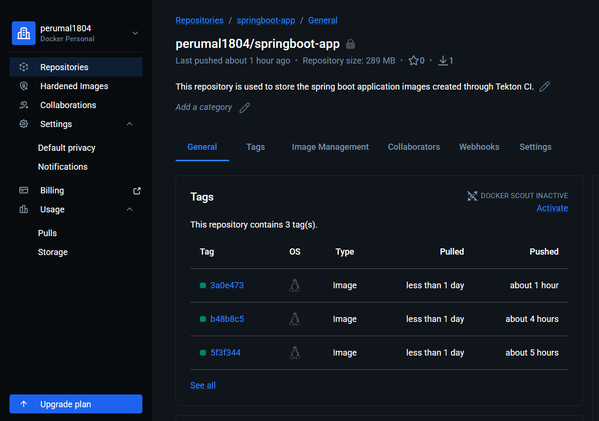

---

# 🔐 DevSecOps Practices Implemented

* ✅ SAST (SonarCloud)
* ✅ SCA (Trivy FS)
* ✅ Container Scan (Trivy Image)
* ✅ Secure Image Promotion
* ✅ Secrets Management
* ✅ Shift-left security

---

# 🐞 Troubleshooting

### ❌ Pipeline not triggering

* Check ngrok running
* Verify webhook URL

### ❌ Permission issues

* Check RBAC / ServiceAccount

### ❌ Image push failure

* Validate DockerHub secret

### ❌ Branch issues

* Handled in clone task

---

# 🚀 Final Output

✔ Secure Docker image pushed to DockerHub
✔ Fully automated CI pipeline
✔ DevSecOps practices enforced

---

# 👤 Author

**Perumal S**

